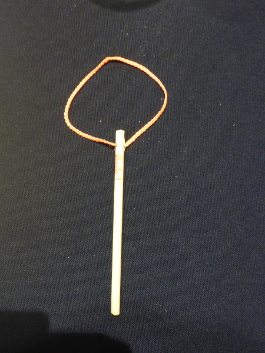
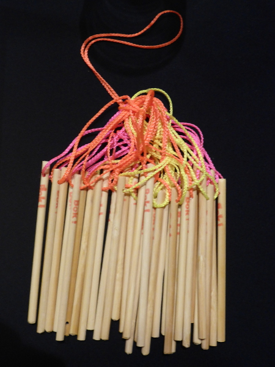

# BokkyPooBah's Tricky Stick Leaderboard For Devcon3 In Cancun 2017

## Leaderboard

* [x] [Oct-31-2017 09:07:05 PM +UTC](https://etherscan.io/tx/0x6b0fbb6db086c75506dc8fd522af116ad599f521edd12155e063f380777666fb) `/u/cryptopascal` `20' witnessed by linkedin.com/in/samuelgbrooks`

 

[100 tricky stick puzzles disrupted Devcon2 in Shanghai 2016](https://www.bokconsulting.com.au/blog/100-tricky-stick-puzzles-disrupt-the-ethereum-devcon2-conference-in-shanghai/).

200 tricky stick puzzles have been prepared Devcon3 in Cancun,  with the first solved by [/u/cryptopascal](https://www.reddit.com/user/cryptopascal) in ~20 minutes.

Record down your name (handle) and the time you took to solve the tricky stick puzzle (or not).

The leaderboard has been deployed to [0xa0ecd8ef29750e7c3501c5568fdd9f4f5bcfe3d9](https://etherscan.io/address/0xa0ecd8ef29750e7c3501c5568fdd9f4f5bcfe3d9#code).

Watch the leaderboard using the address, Application Binary Interface, then execute `solved(string name, string timeToSolve)` with your name and 
the time it took you to solve (or not) the puzzle.

And your entry will forever (maybe) be recorded on the Ethereum blockchain. Hold on to your private key, you can verify that you hold the private
key to your entry, in the future.

 

Enjoy.

(c) BokkyPooBah / Bok Consulting Pty Ltd - Oct 31 2017. The MIT Licence.